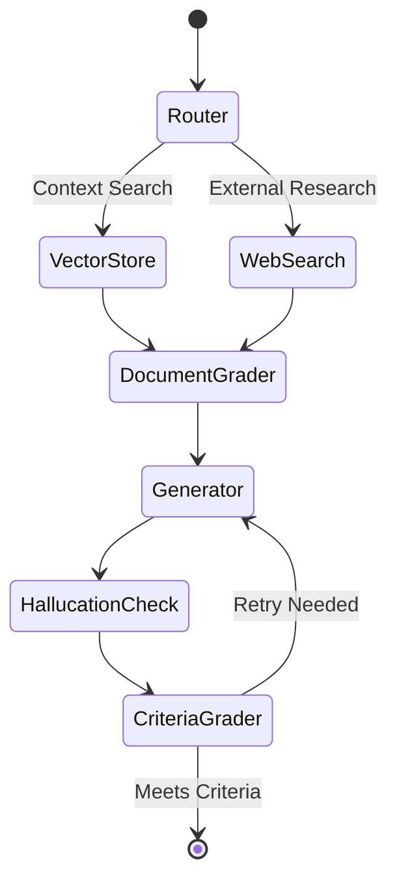
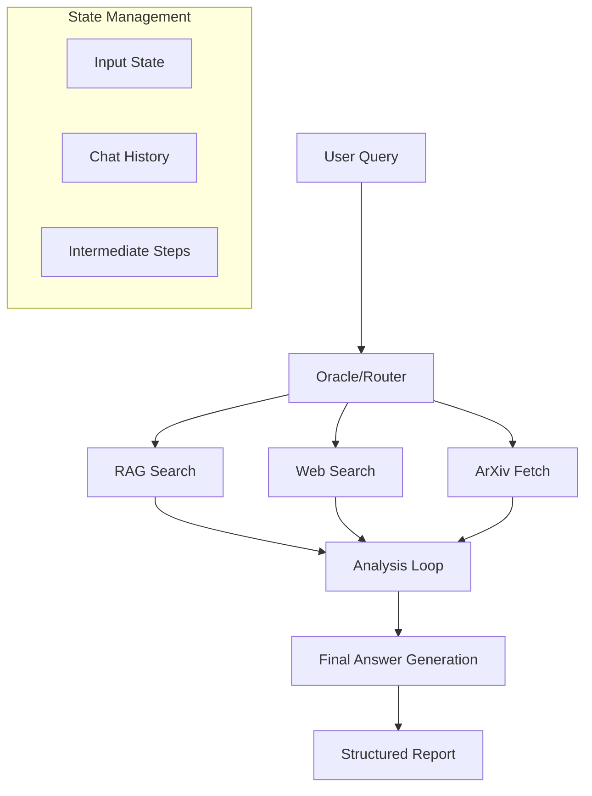

# Table of Contents

-[Choice of AI model](#CHOICE-OF-AI-MODEL)
## Challenge 1: Context-Aware Government Opinion Request System
- [Problem Statement](#problem-statement)
- [Solution](#solution)
  - [Demo](#Demo)
  - [How to Run the project](#how-to-run-the-project)
  - [Solution Architecture](#solution-architecture)
  - [Core Workflow](#core-workflow)
  - [HOW TO RUN THE PROJECT](#how-to-run-the-project)
  - [Key Components](#key-components)
    - [1. Intelligent Router](#1-intelligent-router)
    - [2. Document Processing](#2-document-processing)
    - [3. Multi-Stage Grading System](#3-multi-stage-grading-system)
    - [4. Graph-Based Control Flow](#4-graph-based-control-flow)
- [Technical Implementation](#technical-implementation)
  - [Core Dependencies](#core-dependencies)
  - [State Management](#state-management)
- [Security & Scalability Features](#security--scalability-features)
  - [Secure Implementation](#secure-implementation)
  - [Scalability Approach](#scalability-approach)
- [User Interface](#user-interface)
- [Arabic Language Support](#arabic-language-support)
- [Future Improvements](#future-improvements)
  - [Technical Enhancements](#technical-enhancements)
  - [Workflow Optimization](#workflow-optimization)
- [Development Setup](#development-setup)
- [Testing](#testing)

## Challenge 2: Research Context Agent
- [Problem Statement](#problem-statement-1)
- [Solution](#Our-Solution:-Graph-Based-Research-Agent)
  - [Demo](#Demo-1)
  - [How to Run the project](#how-to-run-the-project-1)
- [Architecture](#architecture)
- [Core Workflow Components](#core-workflow-components)
- [Technical Implementation](#technical-implementation-1)
  - [State Management](#state-management-1)
  - [Graph Construction](#graph-construction)
- [Security & Scalability Features](#security--scalability-features-1)
- [Required Setup](#required-setup)
- [Future Development Areas](#future-development-areas)
- [Development Notes](#development-notes)


### CHOICE OF AI MODEL
- Throughout we are using LLama models hosted on Groq. This is for performance reasons and this can switched for on-premises implementation
- The open source models executes everything including tool calling.

## Challenge 1  Context-Aware Government Opinion Request System

## Problem Statement
Government departments currently handle Internal Opinion Requests through a manual, fragmented process that lacks:
- Standardized analysis workflows
- Context preservation across requests
- Efficient document retrieval
- Consistent evaluation criteria
- Cross-department knowledge sharing

## Solution

## Demo


https://github.com/user-attachments/assets/a9f9828b-24c6-413d-9201-9d99a779d207


### HOW TO RUN THE PROJECT
```bash
# Clone repository
git clone [https://github.com/tofaramususa/Aqlan](https://github.com/tofaramususa/Aqlan.git)

# Install dependencies
pip install -r requirements.txt

# Set up environment variables
THE .env contains api keys already which l will delete after 24hours

# Go into 1. Aqlan Request Agent - Internal Opinion Request and run
streamlit run agentWorkflow.py
```


## Solution Architecture
We've developed a context-aware system that implements an intelligent workflow for processing opinion requests using LangGraph and LangChain frameworks.


### Core Workflow


### Key Components

#### 1. Intelligent Router
```python
router_instructions = """
Determine routing based on request context:
- Vectorstore: Internal documents and policies
- Web search: Supporting external research
Return JSON with datasource decision
"""
```

#### 2. Document Processing
- **Vector Store Implementation**:
```python
vectorstore = SKLearnVectorStore.from_documents(
    documents=doc_splits,
    embedding=NomicEmbeddings(
        model="nomic-embed-text-v1.5",
        inference_mode="local"
    )
)
retriever = vectorstore.as_retriever(k=3)
```

#### 3. Multi-Stage Grading System
```python
# Document relevance assessment
doc_grader_instructions = """
Grade document relevance based on:
- Keyword matching
- Semantic relevance
- Context alignment
"""

# Hallucination prevention
hallucination_grader_instructions = """
Verify generation is grounded in:
- Retrieved documents
- Department context
- Historical decisions
"""

# Criteria-based evaluation
answer_grader_instructions = """
Evaluate response against:
- Question relevance
- Supporting evidence
- Format compliance
"""
```

#### 4. Graph-Based Control Flow
```python
workflow = StateGraph(GraphState)

# Node definition
workflow.add_node("retrieve", retrieve)
workflow.add_node("grade_documents", grade_documents)
workflow.add_node("generate", generate)

# Edge configuration
workflow.add_conditional_edges(
    "grade_documents",
    decide_to_generate,
    {
        "websearch": "websearch",
        "generate": "generate",
    }
)
```

### Technical Implementation

#### Core Dependencies
```txt
langchain-community
langchain-nomic
langgraph
scikit-learn
streamlit
tiktoken
tavily-python
```


#### State Management
```python
class GraphState(TypedDict):
    question: str          # Input request
    generation: str        # Generated response
    web_search: str       # Search decision
    max_retries: int      # Generation attempts
    answers: int          # Response count
    loop_step: int        # Workflow position
    documents: List[str]  # Retrieved contexts
```

### Security & Scalability Features

#### Secure Implementation
- Local model deployment via Ollama
- Controlled API access for web searches
- On-premises vector store
- Document access controls

#### Scalability Approach
- Graph-based workflow architecture
- Modular component design
- Pluggable model support
- Extensible tool integration

### User Interface
Built with Streamlit for practical deployment:

```python
def main():
    st.title("Opinion Request Processing System")
    
    # Input section
    request_text = st.text_area("Enter Opinion Request")
    department = st.selectbox("Select Department", 
                            ["Legal", "Finance", "Strategic"])
    
    if st.button("Process Request"):
        # Initialize workflow
        workflow = initialize_graph()
        
        # Process with progress tracking
        with st.spinner("Processing..."):
            result = workflow.run({
                "question": request_text,
                "max_retries": 3,
                "department": department
            })
            
        # Display results
        st.subheader("Analysis Summary")
        st.write(result.summary)
        
        st.subheader("Supporting Documents")
        st.write(result.documents)
        
        st.subheader("Recommendations")
        st.write(result.recommendations)
```

### Arabic Language Support
- Integration with Arabic-compatible embeddings
- Bilingual document processing
- RTL interface support

### Future Improvements

#### Technical Enhancements
- Enhanced Arabic NLP capabilities
- Additional document format support
- Extended model options
- Improved visualization tools

#### Workflow Optimization
- Advanced routing logic
- Extended criteria frameworks
- Enhanced context retrieval
- Improved feedback loops

### Testing
```python
# Example test case
inputs = {
    "question": "Analysis request for educational technology adoption",
    "max_retries": 3,
    "department": "Strategic"
}

# Run workflow
results = graph.run(inputs)
```

This implementation focuses on:
- Context-aware processing
- Criteria-based evaluation
- Secure document handling
- Scalable architecture
- Arabic language support
- Practical deployment

The system is designed to be extended with additional tools and capabilities while maintaining security and performance requirements.

# Challenge 2: Research Context Agent
## Context-Aware Research Analysis for Government Decision Making

## Problem Statement

Government departments face a critical challenge in research efficiency:

- Teams spend excessive time manually researching key topics
- Research efforts are often duplicated across departments
- Information must be gathered from multiple sources (reports, statistics, benchmarks)
- Current processes lack systematic analysis of existing documentation
- Need for secure, context-aware analysis that leverages existing knowledge

## Our Solution: Graph-Based Research Agent

We've developed a research agent that streamlines document analysis and recommendation generation through a structured workflow. The system emphasizes context awareness and criteria-based analysis while maintaining security through open-source components.

## Demo


https://github.com/user-attachments/assets/959e613b-a891-4d23-915c-1fdca1c1b6e1


### How to run the Project
```bash
# Clone repository
git clone [https://github.com/tofaramususa/Aqlan](https://github.com/tofaramususa/Aqlan.git)

# Install dependencies
pip install -r requirements.txt

# Set up environment variables
THE .env contains api keys already which l will delete after 24hours

# Go into 2. Aqlan Research Agent - Research and Benchmarking
streamlit run researchUI.py
```

### Architecture



### Core Workflow Components

1. **Context-Aware Router (Oracle)**
   - Uses LLM to determine optimal research path
   - Maintains state through intermediate steps
   - Prevents redundant tool usage
   - Tracks chat history for context preservation

2. **Research Tools**
   ```python
   tools = [
       rag_search_filter,  # Document-specific search
       rag_search,         # Knowledge base search
       fetch_arxiv,        # Research paper retrieval
       web_search,         # General information
       final_answer        # Report generation
   ]
   ```

3. **Analysis Criteria Framework**
   - Summarizes initial request
   - Deep analysis using provided content
   - Identifies relevant existing documents
   - Comparative analysis with similar cases
   - Evidence-based recommendations
   - Source attribution

4. **Report Generation Structure**
   ```python
   @tool("final_answer")
   def final_answer(
       introduction: str,      # Question context
       research_steps: str,    # Analysis process
       main_body: str,        # Primary findings
       conclusion: str,        # Key recommendations
       sources: str           # Reference attribution
   )
   ```

### Technical Implementation

#### State Management
```python
class AgentState(TypedDict):
    input: str                # User query
    chat_history: list        # Conversation context
    intermediate_steps: list  # Research progress
```

#### Graph Construction
```python
# Initialize with AgentState
graph = StateGraph(AgentState)

# Core nodes
graph.add_node("oracle", run_oracle)
graph.add_node("rag_search", run_tool)
graph.add_node("web_search", run_tool)
graph.add_node("final_answer", run_tool)

# Dynamic routing
graph.add_conditional_edges(
    source="oracle",
    path=router
)
```

### Security & Scalability Features

1. **Security Implementation**
   - Local vector storage for document analysis
   - API-based web search without data retention
   - Compatible with open-source models for on-premises deployment

2. **Scalable Architecture**
   - Graph-based design allows tool addition
   - State management supports complex workflows
   - Modular tool integration system

### Required Setup

1. Core Dependencies:
```bash
langchain==0.2.5
langgraph==0.1.1
langchain-core==0.2.9
semantic-router==0.0.48
```

### Future Development Areas

1. **Arabic Language Support**
   - Integration with Arabic-capable models
   - Bilingual document processing

2. **Enhanced Context Management**
   - Department-specific analysis criteria
   - Extended document history tracking
   - Improved source correlation

3. **Tool Expansion**
   - Additional data source integrations
   - Specialized analysis modules
   - Custom criteria frameworks

## Development Notes

The system is built on LangGraph for workflow management and uses a combination of RAG and tool-based approaches for comprehensive research analysis. The architecture emphasizes:

- Context preservation through state management
- Criteria-based analysis workflows
- Secure, scalable information processing
- Source attribution and verification
- Tool extensibility through graph architecture

---

*This project is part of the AI government solution hackathon, focusing on research automation and context-aware analysis.*
